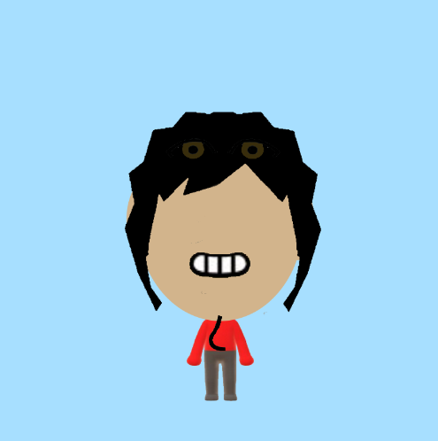

# Art Jam Responses

## [Lucie's Art Jam Response](https://luciee246.github.io/cart253/topics/art-jam/)
To start off, I was already surprised to see a microphone instead of a mouse cursor but even more so when I brought the microphone close to the mouth of the character on the screen and music started playing. I think this was a very clever project that helped me have an idea of what Lucie's interests might be; my guess would be singing or music. Another thing that stuck out to me was how easy it was to interact with the project. Right when I realized the character's mouth got bigger as I brought the microphone closer to it, I knew that bringing the mic closer to the mouth would create some type of reaction. Indeed, that reaction was the change of volume as I brought the microphone closer or further away from the mouth. When the microphone is too far from the mouth and the music can't be heard anymore, I really love how the music pauses and resumes when the microphone close enough to the mouth so the music can be heard again. It makes the interaction feel seamless and polished.
One thing about me is I like to play around with projects in my own way, and I loved playing around with the way the volume would change as I played with the distance between the mic and the mouth. I like doing this especially when the singer would hit high notes in the song because it created an echo like effect or a reverberation since the volume would fade in and out.

## [Marc's Art Jam Response](https://coolusermarco.github.io/cart253/CART%20253%20Pippins/art%20jam%20project%20self%20portrait%20marc%20pilliot/index.html)
I love the character customization aspect of this project. I didn't expect to interact with images on p5, and I feel like this project was a nice take on using images instead of the shapes. After looking at the code, I learned a lot on how to use images in p5. Using images are kind of a combination of loading in the assets like you would with sound but having similar arguments as shapes to set the image's position and size. At first, I thought the images had some type of collision box, but I later realized that Marc used the distance between the mouse's position and the image's position to check if the mouse was overlapping that specific image. The mouse pressed function was then used to move each part of the Mii avatar based on which part the mouse was overlapping. I noticed that since overlapping the hair was the first overlap being checked, smaller parts such as the eye and nose were lower on the check overlap hierarchy, meaning even when the mouse would overlap the eye and hair at the same time the hair overlap would take precedence. This made me wonder if checking the overlap of smaller parts of the body such and eye and nose first before the hair would make the mouse interaction smoother and more seamless. Overall, the customization aspect of this project was really fun, and I did my own thing as I usually do and here is a screenshot of what I did below!

## Huynh's Art Jam Response