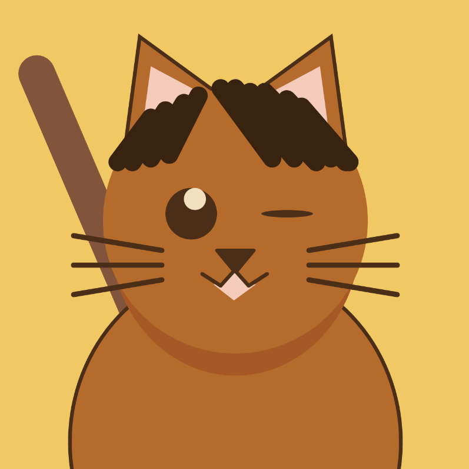

# My Cat-Sona

Lanna Check

[View this project online](https://lannacheck-ops.github.io/cart253/art-jam/template-p5-project/)

## Description

My Cat-Sona is an interactive self-potrait where the player pets my cat persona using the mouse. 

### Controls
> - Press and hold over the cat's head to while moving the mouse to pet the cat.
> - Click on the cat's eyes to make it blink.

### New Functions Used
> - function preload()
> - loadSound()
> - music.play()
> - music.loop()
> - music.setVolume()
> - cursor(HAND)
## Screenshot(s)
> 

## Attribution
JavaScript libraries:
[p5.js](https://p5js.org/) and p5.sound.Js

Sound assets are all from freesound.org:
> - Blink sound: https://freesound.org/people/shaino123/sounds/695547/
> - Meow sound: https://freesound.org/people/tuberatanka/sounds/110010/
> - Purring sound: https://freesound.org/people/Leoni@FS/sounds/410172/
> - Lo-Fi music: https://freesound.org/people/ZHR%C3%98/sounds/679021/

## License
> This project is licensed under a Creative Commons Attribution ([CC BY 4.0](https://creativecommons.org/licenses/by/4.0/deed.en)) license with the exception of libraries and other components with their own licenses.