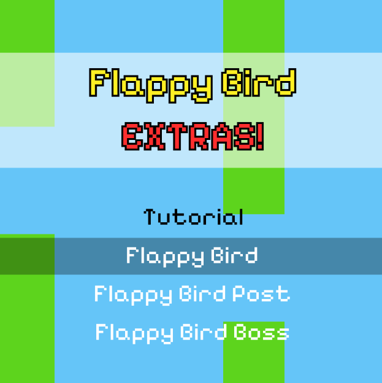
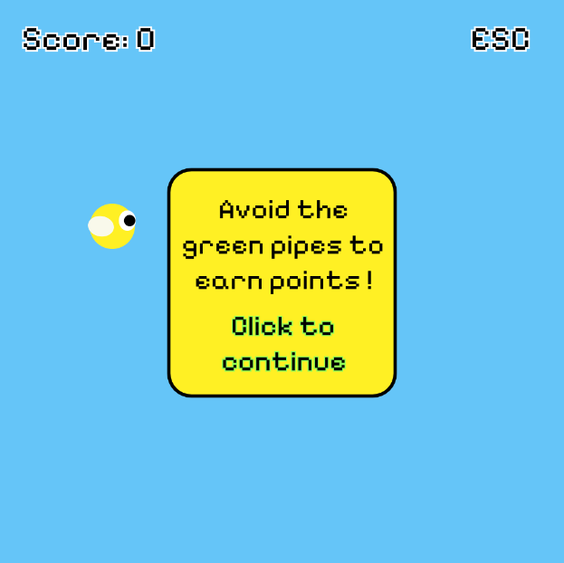
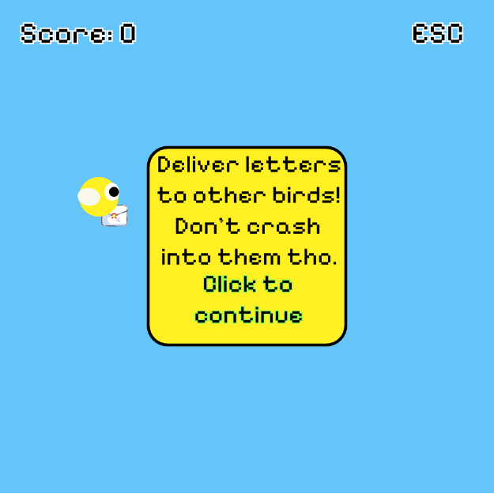
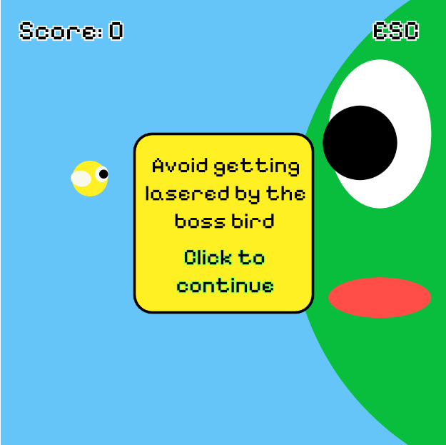

# Flappy Bird EXTRAS!
Lanna Check

[View this project online](https://lannacheck-ops.github.io/cart253/art-jam/template-p5-project/)

## Description

3 versions of the Flappy Bird game ! The original Flappy Bird, Flappy Bird mailman and Flappy Bird escapes the BIRD BOSS!

### Controls
> - Click anywhere on the screen to launch the bird up
> - Press space to deliver letters
> - Press esc to get back to the main menu

### Variations
> - My first variation was of an inspiration of the regular flappy bird game where the player has to launch the bird up by clicking anywhere on the screen to escape the green pipes while staying within the canvas. Escaping pipes increases points.
> - My second variation was of flappy bird delivering mail/letters to other birds to gain points. Players must press the spacebar to drop the mail at the right moment to deliver it to the birds at the bottom of the screen. Delivering mail increases points.
> - My third variation was flappy bird escaping the laser attcks of the bird boss while still escaping pipes. Escaping each attack increases points.

## Screenshot(s)
> 
> 
> 
> 

## Attribution
JavaScript libraries:
[p5.js](https://p5js.org/) and p5.sound.Js

Credit to Pippin Barr for the base code from [Variation Menu](https://pippinbarr.com/cart253/templates/variations-menu.zip)

Sound assets are all from freesound.org:
> - Button UI sound: https://freesound.org/people/Bpianoholic/sounds/620391/
> - Critical hunger sound: https://freesound.org/people/Deathbygeko/sounds/190843/
> - Fly buzzing sound: https://freesound.org/people/FunWithSound/sounds/390733/
> - Fly pick up sound: https://freesound.org/people/Strechy/sounds/654251/
> - Game over sound: https://freesound.org/people/deleted_user_877451/sounds/76376/
> - Background music: https://freesound.org/people/josefpres/sounds/832079/
> - Potion pick up sound: https://freesound.org/people/andersmmg/sounds/523425/
> - Potion spawn sound: https://freesound.org/people/Jamius/sounds/41529/
> - Potion use sound: https://freesound.org/people/kianda/sounds/328120/
> - Slurp sound: https://freesound.org/people/Breviceps/sounds/445974/
> - Yellow fly pick up sound: https://freesound.org/people/Raclure/sounds/458867/

## License
> This project is licensed under a Creative Commons Attribution ([CC BY 4.0](https://creativecommons.org/licenses/by/4.0/deed.en)) license with the exception of libraries and other components with their own licenses.